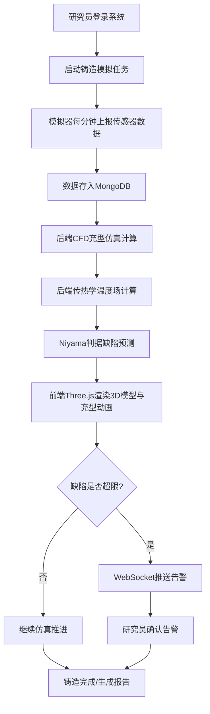

# 古代失蜡法精密铸造充型仿真与缺陷预测系统 - 产品需求文档

## 1. 产品概述

本系统为某工艺史团队提供曾侯乙尊盘失蜡法工艺复原研究的数字化仿真平台，通过实时传感器数据采集、计算流体力学仿真、三维可视化与缺陷预测，助力古代青铜铸造工艺的科学复原与再现。系统每分钟采集蜡模温度、浇铸温度、型壳透气性、铸件缺陷检测等模拟数据，实现充型过程可视化与缺陷预警。

- 目标用户：工艺史研究团队、材料科学研究者、考古数字化工作者
- 产品价值：将千年失蜡法工艺与现代CFD/传热学仿真技术结合，为文物复原提供科学量化依据

## 2. 核心功能

### 2.1 用户角色

| 角色 | 注册方式 | 核心权限 |
|------|----------|----------|
| 研究员 | 系统分配账号 | 查看实时数据、控制仿真、导出报告、管理告警 |
| 管理员 | 系统分配账号 | 用户管理、参数配置、系统维护、数据备份 |

### 2.2 功能模块

1. **实时监控仪表盘**：传感器数据实时曲线、铸造状态总览、告警列表
2. **三维充型仿真**：Three.js铸件模型、铜液充型粒子动画、温度场热力图
3. **缺陷预测面板**：Niyama判据计算、缩孔缩松位置标注、严重程度分级
4. **告警中心**：WebSocket实时推送、缩孔体积超限告警、充型不足预警
5. **历史数据回放**：历史铸造过程回溯、参数对比分析

### 2.3 页面详情

| 页面名称 | 模块名称 | 功能描述 |
|----------|----------|----------|
| 实时监控仪表盘 | 数据卡片 | 显示当前蜡模温度、浇铸温度、型壳透气性、铸造进度百分比 |
| 实时监控仪表盘 | 实时曲线 | ECharts渲染温度/透气性随时间变化曲线，支持多参数叠加 |
| 实时监控仪表盘 | 告警列表 | 滚动显示未处理告警，按严重程度着色 |
| 三维充型仿真 | 铸件3D视图 | Three.js渲染尊盘三维模型，支持旋转缩放拖拽 |
| 三维充型仿真 | 充型粒子动画 | Canvas+粒子系统模拟铜液流动，按时间进度推进充型率 |
| 三维充型仿真 | 温度场叠加 | 基于传热学模型在模型表面渲染温度渐变热力图 |
| 三维充型仿真 | 缺陷标记 | 红色球体/高亮区域标注缩孔缩松位置，尺寸表示严重程度 |
| 缺陷预测面板 | Niyama判据 | 显示各单元Niyama值分布直方图与阈值线 |
| 缺陷预测面板 | 缺陷列表 | 表格展示所有预测缺陷的坐标、体积、严重程度 |
| 告警中心 | 实时推送 | WebSocket连接，弹窗+声音提醒，支持一键确认 |
| 历史数据回放 | 过程回放 | 时间轴拖动，回放充型动画、温度变化、缺陷生成过程 |

## 3. 核心流程

### 3.1 主流程描述
研究员登录系统→启动铸造模拟→模拟器每分钟上报传感器数据→后端基于CFD/传热学模型计算充型进度与温度场→基于Niyama判据预测缩孔缩松→前端通过Three.js实时渲染3D充型过程与缺陷标记→若缩孔体积超限或充型不足则触发WebSocket告警→研究员确认告警并记录分析结论。

### 3.2 流程图

## 4. 用户界面设计

### 4.1 设计风格

- **主色调**：深青铜色 #B87333、古铜金 #D4AF37、墨黑底色 #0D0D0D
- **辅助色**：警示红 #E63946（缺陷标记）、温度橙 #FF6B35（高温区）、冷静蓝 #457B9D（低温区）
- **按钮风格**：金属质感边框，微悬浮阴影，青铜色渐变填充
- **字体**：标题采用「思源宋体」凸显历史厚重感，正文采用「JetBrains Mono」等宽字体保障数据可读性
- **布局风格**：深色工业风仪表盘布局，左侧导航栏+中央3D主视图+右侧数据面板
- **图标风格**：线性金属描边图标，配合青铜质感发光效果

### 4.2 页面设计概览

| 页面名称 | 模块名称 | UI元素 |
|----------|----------|--------|
| 实时监控仪表盘 | 数据卡片 | 金属边框卡片，数值大号青铜色字体，微渐变背景 |
| 实时监控仪表盘 | 实时曲线 | 深色背景，青铜金色线条，温度热力渐变填充 |
| 三维充型仿真 | 3D视图 | 全屏深色背景，环境光+方向光营造青铜质感，红色缺陷标记高亮 |
| 三维充型仿真 | 控制面板 | 底部悬浮玻璃拟态控制条，播放/暂停/进度拖拽 |
| 缺陷预测面板 | 缺陷列表 | 斑马纹表格，严重程度行背景着色（深红/橙/黄） |
| 告警中心 | 告警弹窗 | 右上角滑入式告警，红色脉冲动画，确认按钮 |

### 4.3 响应式

- 桌面端优先设计（1920×1080基准），中央3D视图自适应伸缩
- 平板端折叠右侧面板至底部抽屉
- 移动端以数据监控为主，3D视图降级为2D剖面图

### 4.4 3D场景指引

- **环境**：HDRI模拟博物馆暖光环境，青铜材质PBR渲染，营造文物展陈氛围
- **光照**：主光源45°侧上方模拟展柜射灯，环境光补充暗部细节，点光源突出缺陷标记
- **相机**：PerspectiveCamera，初始距离模型中心3倍半径，支持OrbitControls环绕观察
- **构图**：尊盘模型居中，缺陷标记用红色发光球体（PointLight+SphereGeometry）悬浮于对应位置
- **交互**：充型过程随时间推进自动旋转模型展示各角度，hover缺陷标记显示详情面板
- **后处理**：Bloom泛光使缺陷红光溢出，FXAA抗锯齿，轻微Vignette暗角烘托氛围
- **性能**：尊盘模型面数控制在5万面内，粒子系统采用BufferGeometry+PointsMaterial，单帧粒子数≤5000
