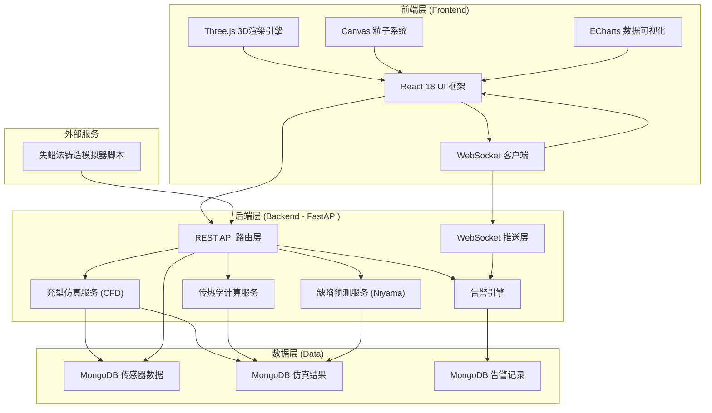
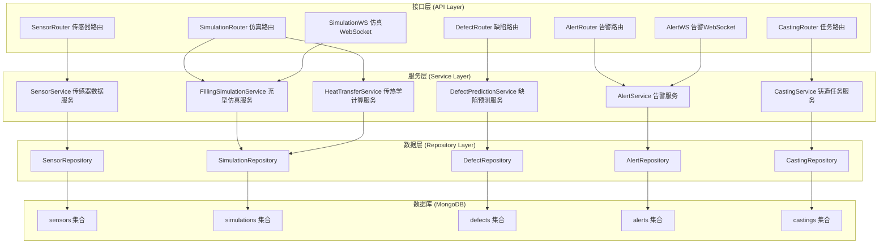
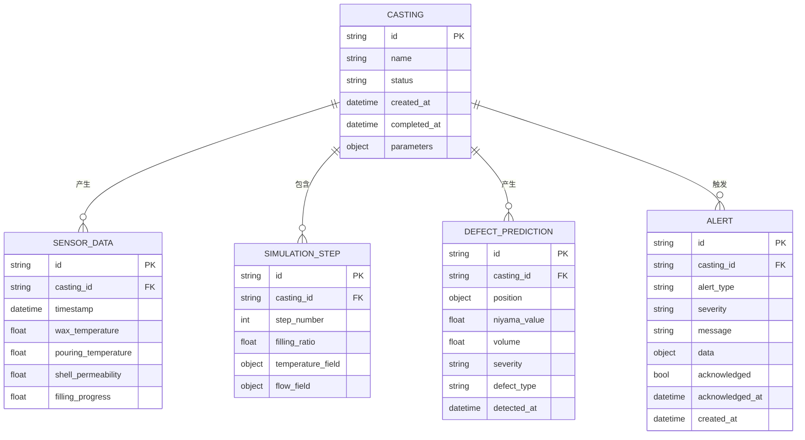

# 古代失蜡法精密铸造充型仿真与缺陷预测系统 - 技术架构文档

## 1. 架构设计



## 2. 技术说明

### 2.1 整体技术栈
- **前端**：React@18 + Vite@5 + Three.js@0.160 + ECharts@5 + TailwindCSS@3
- **初始化工具**：Vite 5 脚手架初始化 React 项目
- **后端**：Python 3.11 + FastAPI@0.108 + uvicorn@0.27
- **数据库**：MongoDB 6.0 + pymongo@4.6
- **仿真计算**：NumPy@1.26 + SciPy@1.11
- **实时通信**：FastAPI WebSocket
- **模拟器**：独立 Python 脚本，通过 HTTP API 上报数据

### 2.2 前端技术细节
- **3D渲染**：Three.js 使用 PBR 物理材质渲染青铜铸件，OrbitControls 实现交互
- **粒子系统**：THREE.BufferGeometry + THREE.PointsMaterial 实现铜液充型粒子
- **温度场**：顶点着色器 (Vertex Shader) 根据温度值动态染色
- **缺陷标记**：SphereGeometry + 发光材质 + PointLight 实现红色缺陷高亮
- **图表**：ECharts 渲染实时温度曲线、Niyama 直方图

### 2.3 后端技术细节
- **充型仿真**：基于简化 CFD 模型，使用体积填充法 (VOF) 计算充型率
- **传热学计算**：傅里叶热传导方程有限差分求解温度场
- **Niyama判据**：Niyama = G / √(R)，其中G为温度梯度，R为冷却速率
- **缩孔预测**：基于Niyama值阈值判断缩孔缩松风险区域
- **告警引擎**：检测缩孔体积超限(>5cm³)或充型不足(<95%)触发告警

## 3. 路由定义

### 3.1 前端路由

| 路由 | 用途 |
|------|------|
| / | 实时监控仪表盘（默认首页） |
| /simulation | 三维充型仿真主视图 |
| /defects | 缺陷预测面板 |
| /alerts | 告警中心 |
| /history | 历史数据回放 |

### 3.2 后端 API 路由

| 方法 | 路由 | 用途 |
|------|------|------|
| POST | /api/sensor/data | 传感器数据上报 |
| GET | /api/sensor/latest | 获取最新传感器数据 |
| GET | /api/sensor/history | 获取历史传感器数据 |
| POST | /api/simulation/start | 启动仿真任务 |
| POST | /api/simulation/stop | 停止仿真任务 |
| GET | /api/simulation/status | 获取仿真状态 |
| GET | /api/simulation/filling | 获取充型进度数据 |
| GET | /api/simulation/temperature | 获取温度场数据 |
| GET | /api/defects/predictions | 获取缺陷预测结果 |
| GET | /api/defects/niyama | 获取Niyama判据数据 |
| GET | /api/alerts | 获取告警列表 |
| POST | /api/alerts/{id}/acknowledge | 确认告警 |
| GET | /api/castings | 获取铸造任务列表 |
| POST | /api/castings | 创建铸造任务 |
| WS | /ws/simulation | 仿真实时数据WebSocket |
| WS | /ws/alerts | 告警实时推送WebSocket |

## 4. API 定义（后端）

```python
# ============ 数据模型定义 ============

from pydantic import BaseModel, Field
from datetime import datetime
from typing import List, Optional, Dict

class SensorData(BaseModel):
    casting_id: str = Field(..., description="铸造任务ID")
    timestamp: datetime = Field(default_factory=datetime.now)
    wax_temperature: float = Field(..., ge=0, le=2000, description="蜡模温度(°C)")
    pouring_temperature: float = Field(..., ge=0, le=2000, description="浇铸温度(°C)")
    shell_permeability: float = Field(..., ge=0, le=100, description="型壳透气性(%)")
    filling_progress: float = Field(..., ge=0, le=100, description="充型进度(%)")

class SimulationStatus(BaseModel):
    casting_id: str
    status: str  # "idle" | "running" | "paused" | "completed" | "error"
    filling_progress: float
    elapsed_time: int  # 秒
    total_steps: int
    current_step: int

class FillingData(BaseModel):
    step: int
    filling_ratio: float  # 0-1
    flow_velocity: List[float]  # [vx, vy, vz]
    pressure: float

class TemperaturePoint(BaseModel):
    x: float
    y: float
    z: float
    temperature: float

class TemperatureField(BaseModel):
    step: int
    points: List[TemperaturePoint]
    max_temperature: float
    min_temperature: float

class DefectPrediction(BaseModel):
    id: str
    casting_id: str
    position: Dict[str, float]  # {"x":.., "y":.., "z":..}
    niyama_value: float
    volume: float  # cm³
    severity: str  # "low" | "medium" | "high" | "critical"
    defect_type: str  # "shrinkage_cavity" | "shrinkage_porosity"
    detected_at: datetime

class Alert(BaseModel):
    id: str
    casting_id: str
    alert_type: str  # "shrinkage_volume_exceeded" | "insufficient_filling" | "temperature_anomaly"
    severity: str  # "warning" | "error" | "critical"
    message: str
    data: Dict
    acknowledged: bool
    acknowledged_at: Optional[datetime]
    created_at: datetime

class CastingTask(BaseModel):
    id: str
    name: str
    status: str
    created_at: datetime
    completed_at: Optional[datetime]
    parameters: Dict  # 工艺参数
```

## 5. 服务端架构图



## 6. 数据模型

### 6.1 数据模型ER图



### 6.2 MongoDB 初始化脚本说明

数据库名：`lost_wax_casting`

集合：
1. **castings** - 铸造任务，索引：{created_at: -1}
2. **sensors** - 传感器数据，索引：{casting_id: 1, timestamp: -1}，TTL索引自动清理30天前数据
3. **simulations** - 仿真步骤数据，索引：{casting_id: 1, step_number: 1}
4. **defects** - 缺陷预测，索引：{casting_id: 1, severity: 1}
5. **alerts** - 告警记录，索引：{casting_id: 1, acknowledged: 1, created_at: -1}
